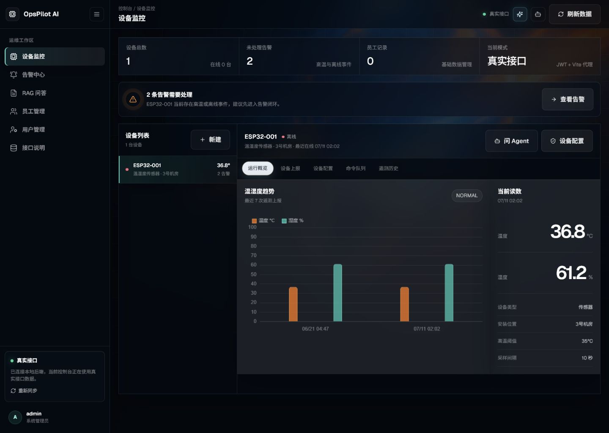
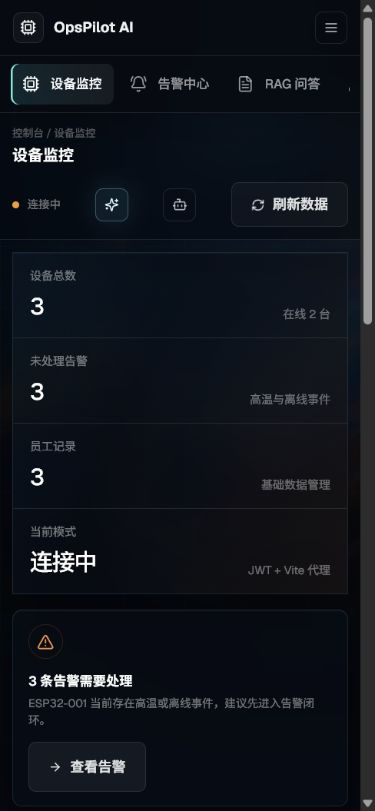
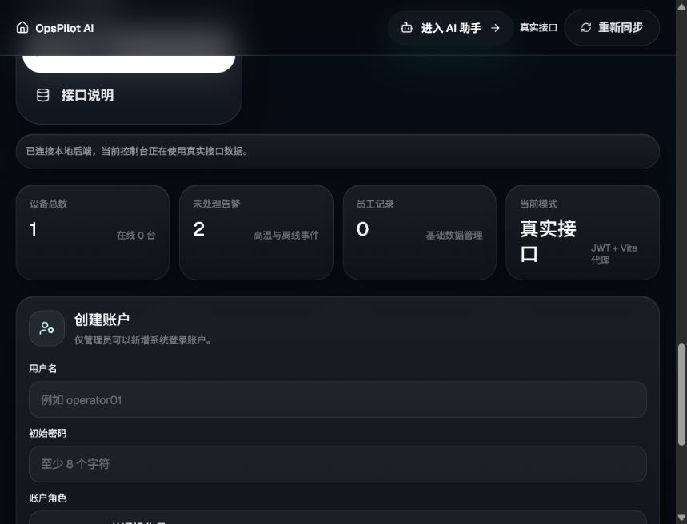

# OpsPilot AI — 企业 AIoT 运维智能体平台

面向企业设备运维场景的 AIoT 智能体平台，支持设备遥测数据采集、状态监控、告警治理、知识库 RAG 问答和 Agent 辅助排障。

## 界面预览



<p align="center">
  
  
</p>

## 技术栈

| 层次 | 技术 |
|------|------|
| 语言 | Java 21 |
| 框架 | Spring Boot 3.2.5 |
| ORM | MyBatis-Plus 3.5.6 |
| 数据库 | MySQL 8.0 |
| 缓存 / 会话 | Redis 7 |
| AI 框架 | LangChain4j 0.34.0 |
| 聊天模型 | DeepSeek（deepseek-chat） |
| Embedding 模型 | 智谱（embedding-3） |
| PDF 解析 | PDFBox 3.0.1 |
| 前端展示 | Vue 3 + Vite + Tailwind CSS |
| 硬件示例 | ESP32 + DHT22 + SSD1306 OLED |
| 容器化 | Docker Compose |

## 核心功能

### 1. 基础数据管理（员工 CRUD）

基础的增删改查，使用 MyBatis-Plus + Redis 缓存（`@Cacheable` / `@CacheEvict`），统一返回 `Result<T>`。

### 2. ESP32 真实硬件接入、配置与告警

```
ESP32 + DHT22 + OLED → HTTP POST / 轮询命令 → Spring Boot → MySQL + Redis → Agent 查询与控制
```

- 设备上报温湿度数据（`POST /device/report`）
- 支持上报 WiFi RSSI、运行时长、固件版本
- 自动更新设备在线状态
- 支持按设备动态配置高温阈值、湿度范围、采样间隔、巡检间隔、屏幕模式
- 温度 / 湿度超过动态阈值时自动生成告警
- Agent 或运维人员可下发 ESP32 命令：屏幕显示、屏幕模式、采样间隔、自检、重启
- 设备命令队列支持 `PENDING -> SENT -> DONE/FAILED` 留痕
- 设备侧接口使用 `X-Device-Token`，数据库仅保存 Token 摘要；管理端接口使用 JWT + RBAC
- 上报接口带 `@Valid` 参数校验
- `@Transactional` 保证多表写入原子性

### 3. NL2SQL 自然语言查库

- SystemPrompt 注入数据库 Schema + Few-shot 范例
- 用户中文问题 → LLM 生成 SQL → JDBC 执行 → 返回结果
- 安全限制：只允许 SELECT，禁止 DELETE/DROP/UPDATE

### 4. RAG 文档问答

```
上传 PDF → 提取文字 → 切片(500字,重叠50) → Embedding 向量化 → 余弦相似度检索 → LLM 生成回答
```

- PDFBox 提取 PDF 纯文本
- 智谱 Embedding 做文本向量化
- 本地余弦相似度计算（纯 Java，不依赖向量数据库）
- 回答附带来源标注：`来源：【第X段/共Y段】`
- 低相似度时拒答："资料中未提及"

### 5. LangChain4j Agent（设备运维 Tool 闭环）

| 工具 | 所属类 | 功能 |
|------|------|------|
| 待办管理 | `TodoTools` | 添加/列出/完成待办任务 |
| 知识库检索 | `KnowledgeTools` | 检索已上传的 PDF 文档 |
| 联网搜索 | `WebSearchTools` | 知识库无结果/低置信时搜索公开网页作为补充证据 |
| 数据库查询 | `DataQueryTools` | NL2SQL 自然语言查数据库 |
| 设备状态 | `DeviceTools` | 查询设备在线状态、温湿度、RSSI、固件和阈值 |
| 告警历史 | `DeviceTools` | 查询设备历史告警记录 |
| 设备日志回放 | `DeviceTools` | 查询最近 N 小时趋势、均值、最高值 |
| 阈值配置 | `DeviceTools` | 动态调整温度/湿度告警阈值 |
| 硬件命令 | `DeviceTools` | 下发屏幕提示、采样间隔、自检、重启命令 |
| 多设备对比 | `DeviceTools` | 横向比较多台 ESP32 的温湿度差异 |
| 定时巡检 | `DeviceTools` | 设置设备主动巡检间隔 |
| 完整诊断 | `DiagnosticTools` | 状态 + 趋势 + 阈值 + 告警 + 建议 + 屏幕提示 |

**Agent 可靠性设计：**

- **ChatMemory 多轮对话**：支持 memoryId 会话隔离，内存 / Redis 双模式可切换
- **ToolCallGuard 死循环控制**：同一工具 + 同一参数连续调用 3 次自动拦截
- **来源透传**：按 memoryId 保存 RAG / 网页检索来源，Agent 回答后代码层追加
- **知识问题路由**：检测说明书/排障类关键词，提示 Agent 优先走 RAG 工具；RAG 返回 `NO_KNOWLEDGE` / `LOW_CONFIDENCE` 时自动触发一次联网搜索兜底

### 6. 用户与权限管理

- 支持 `ADMIN` / `OPERATOR` 两级角色和基于 JWT 的接口鉴权
- 管理员可创建账号、重置密码、调整角色和删除用户
- 密码使用 BCrypt 哈希保存，不在接口中返回密码或摘要
- 内置最后一名管理员保护、自删除保护和重复用户名校验

## 项目结构

```
opspilot-ai/
├── src/main/java/com/opspilot/
│   ├── OpsPilotApplication.java
│   ├── common/               # 配置、统一返回、异常处理
│   │   ├── LangChain4j.java  # LLM / Embedding Bean 配置
│   │   ├── RedisConfig.java
│   │   ├── Result.java       # 统一返回 Result<T>
│   │   └── GlobalExceptionHandler.java
│   ├── controller/           # 接口层
│   │   ├── AuthController.java
│   │   ├── UserController.java
│   │   ├── EmployeeController.java
│   │   ├── DeviceController.java
│   │   ├── PdfController.java
│   │   ├── AgentController.java
│   │   ├── AiController.java
│   │   └── EmbeddingController.java
│   ├── service/              # 业务层 + Agent Tool
│   │   ├── UserService.java
│   │   ├── AgentService.java
│   │   ├── DeviceReportService.java
│   │   ├── PdfService.java
│   │   ├── EmbeddingService.java
│   │   ├── AiService.java
│   │   ├── KnowledgeTools.java
│   │   ├── DeviceTools.java
│   │   ├── DataQueryTools.java
│   │   ├── TodoTools.java
│   │   ├── ToolCallGuard.java
│   │   ├── RedisChatMemoryStore.java
│   │   └── impl/EmployeeServiceImpl.java
│   ├── entity/               # 实体类
│   │   ├── User.java
│   │   ├── Employee.java
│   │   ├── Device.java
│   │   ├── DeviceData.java
│   │   ├── Alarm.java
│   │   └── DeviceReportRequest.java
│   └── mapper/               # MyBatis-Plus Mapper
│       ├── EmployeeMapper.java
│       ├── DeviceMapper.java
│       ├── DeviceDataMapper.java
│       └── AlarmMapper.java
├── src/main/resources/
│   ├── application.yml
│   └── schema.sql            # 建表 SQL + 初始数据
├── postman/
│   └── opspilot-ai.postman_collection.json
├── frontend/                 # Vue 3 + Vite 运维展示端
├── firmware/
│   └── esp32-opspilot/       # ESP32 + DHT22 + OLED 示例固件
├── docker-compose.yml
├── Dockerfile
└── pom.xml
```

## 环境准备

### 1. 环境变量

复制 `.env.example` 可以看到完整配置项。本地运行至少需要设置以下环境变量：

```bash
# Windows (cmd)
set DEEPSEEK_API_KEY=sk-xxxxxxxx
set ZHIPU_API_KEY=xxxxxxxx
set JWT_SECRET=至少32字节的随机字符串
set SPRING_DATASOURCE_PASSWORD=你的MySQL密码

# Windows (PowerShell)
$env:DEEPSEEK_API_KEY="sk-xxxxxxxx"
$env:ZHIPU_API_KEY="xxxxxxxx"
$env:JWT_SECRET="至少32字节的随机字符串"
$env:SPRING_DATASOURCE_PASSWORD="你的MySQL密码"

# macOS / Linux
export DEEPSEEK_API_KEY=sk-xxxxxxxx
export ZHIPU_API_KEY=xxxxxxxx
export JWT_SECRET=至少32字节的随机字符串
export SPRING_DATASOURCE_PASSWORD=你的MySQL密码
```

### 2. 本地启动

**前置依赖：** MySQL 8.0、Redis 7、Java 21、Maven

```bash
# 1. 创建数据库
mysql -u root -p -e "CREATE DATABASE IF NOT EXISTS demo DEFAULT CHARSET utf8mb4"

# 2. 启动 Redis（Windows 可用 Memurai 或 WSL）
redis-server

# 3. 启动应用
cd opspilot-ai
mvn spring-boot:run
```

应用启动后访问：`http://localhost:8080`

### 3. 前端启动

```bash
cd opspilot-ai/frontend
npm install
npm run dev
```

前端访问：`http://127.0.0.1:5173`

前端通过 Vite 代理把 `/api/*` 转发到 Spring Boot 后端 `http://localhost:8080`。

### 4. Docker 启动

```bash
cd opspilot-ai
cp .env.example .env   # Windows 下复制后手动修改也可以
docker compose up -d
```

Docker Compose 会从源码构建并启动 MySQL、Redis、Spring Boot API 和 Nginx 前端四个容器。前端访问 `http://127.0.0.1:5173`。

## API 接口

### 员工管理

| 方法 | 路径 | 说明 |
|------|------|------|
| GET | `/employee` | 查询所有员工 |
| GET | `/employee/{id}` | 按 ID 查员工 |
| POST | `/employee` | 新增员工（JSON Body） |
| PUT | `/employee` | 修改员工（JSON Body） |
| DELETE | `/employee/{id}` | 删除员工 |

### 用户与权限管理（仅限 `ADMIN`）

| 方法 | 路径 | 说明 |
|------|------|------|
| GET | `/users` | 查询用户列表 |
| POST | `/users` | 创建用户 |
| PUT | `/users/{id}/password` | 重置用户密码 |
| PUT | `/users/{id}/role` | 调整用户角色 |
| DELETE | `/users/{id}` | 删除用户 |

### 设备管理

| 方法 | 路径 | 说明 |
|------|------|------|
| GET | `/device/list` | 设备列表 |
| POST | `/device/report` | 设备数据上报（支持 JWT 或 `X-Device-Token`） |
| GET | `/device/{deviceCode}/data` | 设备历史数据 |
| GET | `/device/{deviceCode}/alarms` | 设备告警历史 |
| GET | `/device/{deviceCode}/config` | 查询阈值、采样间隔、屏幕模式 |
| PUT | `/device/{deviceCode}/config` | 更新设备配置，并为采样/屏幕变化生成命令 |
| POST | `/device/{deviceCode}/commands` | 管理端下发设备命令 |
| GET | `/device/{deviceCode}/commands` | 查询命令历史 |
| GET | `/device/{deviceCode}/commands/next` | ESP32 拉取下一条命令（需 `X-Device-Token`） |
| POST | `/device/{deviceCode}/commands/{commandId}/ack` | ESP32 回传命令结果（需 `X-Device-Token`） |

命令类型：

| 类型 | 说明 |
|------|------|
| `DISPLAY_MESSAGE` | OLED 屏幕显示提示文字 |
| `SET_DISPLAY_MODE` | 切换 `NORMAL` / `ALERT` / `MAINTENANCE` |
| `SET_SAMPLE_INTERVAL` | 修改上报间隔，单位秒 |
| `RUN_SELF_TEST` | 执行传感器、WiFi、屏幕自检 |
| `REBOOT` | 重启 ESP32，仅在明确要求时使用 |

### PDF / RAG

| 方法 | 路径 | 说明 |
|------|------|------|
| POST | `/pdf/upload` | 上传 PDF（form-data, key=file） |
| GET | `/pdf/ask?question=xxx` | 检索最相关文本片段 |
| GET | `/pdf/chat?question=xxx` | RAG 问答（检索 + LLM 生成） |

### Agent

| 方法 | 路径 | 说明 |
|------|------|------|
| POST | `/agent/chat` | Agent 对话，JSON Body：`{"message":"...","memoryId":"default"}` |

## 演示顺序

推荐按以下顺序演示，展示从基础到 AI 的完整链路：

1. **员工 CRUD**：`GET /employee` → `POST /employee` → `PUT /employee` → `DELETE /employee/{id}`
2. **真实 ESP32 上报**：烧录 `firmware/esp32-opspilot`，让板子上报温湿度、RSSI、固件版本
3. **动态阈值**：`PUT /device/ESP32-001/config` 把高温阈值调到 30℃，再上报 31℃ 验证告警
4. **命令队列**：`POST /device/ESP32-001/commands` 下发 `DISPLAY_MESSAGE`，观察 OLED 屏幕和命令状态
5. **PDF 上传**：`POST /pdf/upload` 上传一份设备说明书 PDF
6. **RAG 问答**：`GET /pdf/chat?question=设备如何接线` — 基于说明书回答
7. **Agent 趋势查询**：`POST /agent/chat`，message=`ESP32-001 最近6小时温度是不是在升高`
8. **Agent 调阈值**：`POST /agent/chat`，message=`把 ESP32-001 高温阈值调到30度`
9. **Agent 控屏幕**：`POST /agent/chat`，message=`让 ESP32-001 屏幕显示正在巡检`
10. **Agent 排障闭环**：`POST /agent/chat`，message=`帮我诊断 ESP32-001 的高温问题`，memoryId=`test1`

## 测试与质量

```bash
# 后端单元与集成测试
mvn test

# 前端生产构建与浏览器烟雾测试
cd frontend
npm run build
npm run test:e2e
```

当前版本已验证：后端 43 项测试全部通过、前端生产构建通过、桌面端与移动端 2 项 Playwright 烟雾测试通过。

## 配置说明

### 切换 ChatMemory 存储

`application.yml` 中：

```yaml
app:
  agent:
    memory:
      type: memory   # 内存版（重启丢失）
      # type: redis  # Redis 持久化版
      max-messages: 10
      redis-key-prefix: "agent:chat-memory:"
  web-search:
    enabled: true
    endpoint: https://api.duckduckgo.com/
    timeout-ms: 6000
    max-results: 5
```

- `memory`：适合本地开发和演示，重启后对话丢失
- `redis`：ChatMemory 持久化到 Redis，重启后可恢复上下文

## 已知限制

- **RAG 向量为 MySQL JSON 存储**：文档与向量可以跨重启保留，但检索仍是应用层全量余弦计算，适合面试演示和小型知识库；数据量增大后应迁移到 pgvector、Milvus 或 Elasticsearch 向量检索。
- **NL2SQL 安全为 Demo 级**：仅靠 Prompt 约束 + SELECT 白名单保护，生产环境需要 SQL Parser、分页、超时等加固。
- **Agent 知识问题路由仍依赖模型工具调用**：服务端会在 RAG 证据不足且未联网搜索时强制补一次 `webSearch`，但最终措辞仍由模型生成。
- **联网搜索默认使用公开 DuckDuckGo Instant Answer 接口**：适合演示和轻量兜底；生产建议替换为带 SLA 的搜索 API，并加入域名白名单、缓存和审计。
- **自动化测试已覆盖**：包含 ToolCallGuard、WebSearch、设备上报告警、命令并发领取、高风险命令确认、Employee CRUD 和用户权限管理，并在 CI 中同时执行后端测试、前端构建与浏览器烟雾测试。
 
